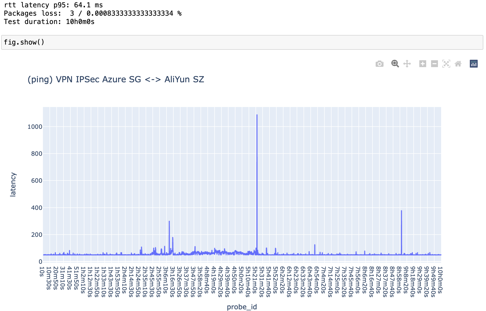

# Simple `ping` results analyzer

## How to use

- Collect data with `ping` command

```bash
  # Run default ping each 10sec and make 3600 probes (=10h)

  ping 10.195.55.132 -i 10 -c 3600  | tee ping_results.txt &
```

- Analyze data with ./simple-ping-analuzer.ipynb

## Example


